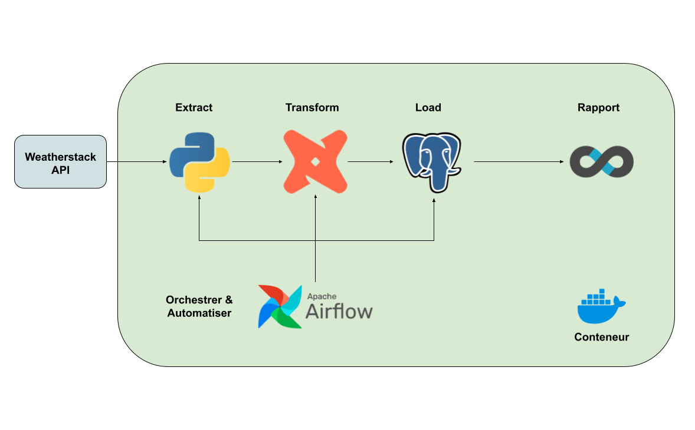
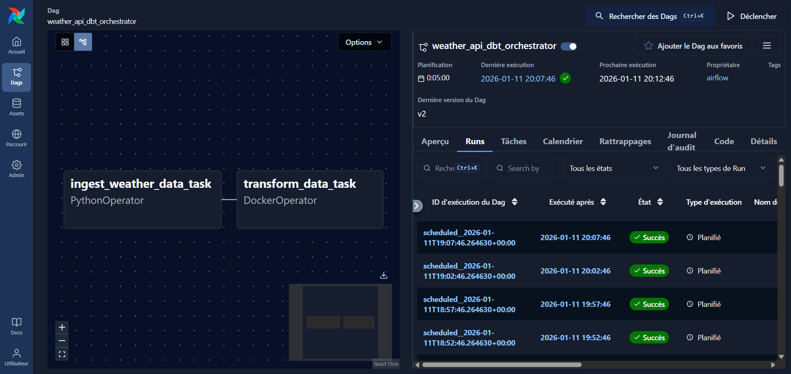
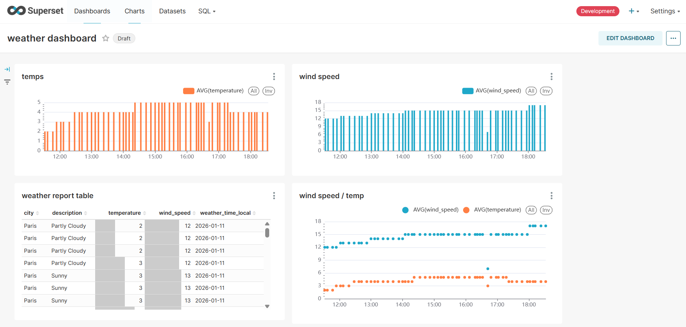

# 🌦️ Weather Data Pipeline – Projet ETL de bout en bout

Ce projet permettant de collecter des données météo en temps réel depuis une API externe, de les stocker dans PostgreSQL, de les transformer avec **dbt**, d’orchestrer les traitements avec **Apache Airflow** et de les visualiser via **Apache Superset**.  
L’ensemble de la stack est **conteneurisé avec Docker**.

---

## Architecture du projet


Weatherstack API -> Ingestion Python (Airflow) -> PostgreSQL (données brutes) -> dbt (transformations) -> PostgreSQL (tables analytiques) -> Apache Superset (dashboards)

---

## Stack technique

- **Docker & Docker Compose** – orchestration des services
- **PostgreSQL 15** – base de données / data warehouse
- **Apache Airflow 3** – orchestration et planification
- **dbt (Postgres adapter)** – transformation et modélisation des données
- **Apache Superset** – visualisation et dashboards
- **Weatherstack API** – source de données météo
- **Python** – ingestion et logique métier

---

## Description du pipeline de données

### 1️. Ingestion des données
- Un **DAG Airflow** s’exécute toutes les **5 minutes**
- Les données météo sont récupérées depuis l’API **Weatherstack**
- Les données brutes sont insérées dans PostgreSQL (`dev.raw_weather_data`)


### 2️. Stockage
Les données stockées incluent :
- Ville
- Température
- Vitesse du vent
- Description météo
- Heure locale
- Décalage UTC
- Timestamp d’insertion


### 3️. Transformation avec dbt

Deux modèles dbt principaux :

#### 🔹 Vue des données météo brutes
- Une ligne par observation API

#### 🔹 Métriques journalières agrégées
- Température moyenne par ville et par jour
- Vitesse moyenne du vent par ville et par jour


### 4️. Orchestration avec Airflow
- Planification : toutes les **5 minutes**
- Tâches :
  1. Ingestion des données météo
  2. Exécution des transformations dbt via **DockerOperator**


### 5️. Visualisation avec Superset
- Connexion directe à PostgreSQL
- Création de dashboards interactifs :
  - Évolution des températures
  - Analyse du vent
  - Répartition des conditions météo

---
## Lancer le projet

### Prérequis
- Docker
- Docker Compose

### Démarrage de la stack
```bash
docker-compose up
```

### Accès aux services
- Airflow: http://localhost:8000
- Superset: http://localhost:8088
- PostgreSQL:	http://localhost:5000

###  Identifiants par défaut
#### PostgreSQL
- Utilisateur : db_user
- Mot de passe : db_password
- Base : db

#### Superset
- Identifiant : admin
- Mot de passe : admin


## Screenshots
 

 